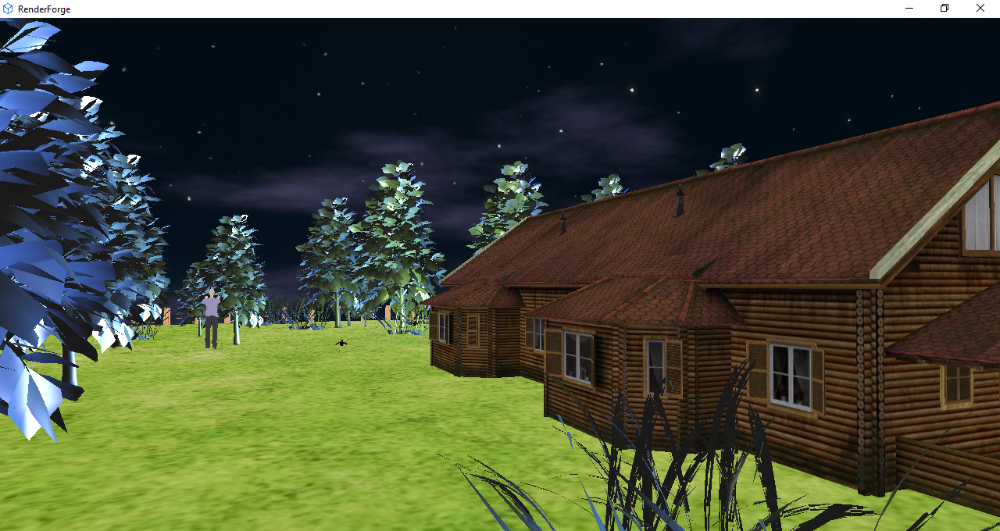
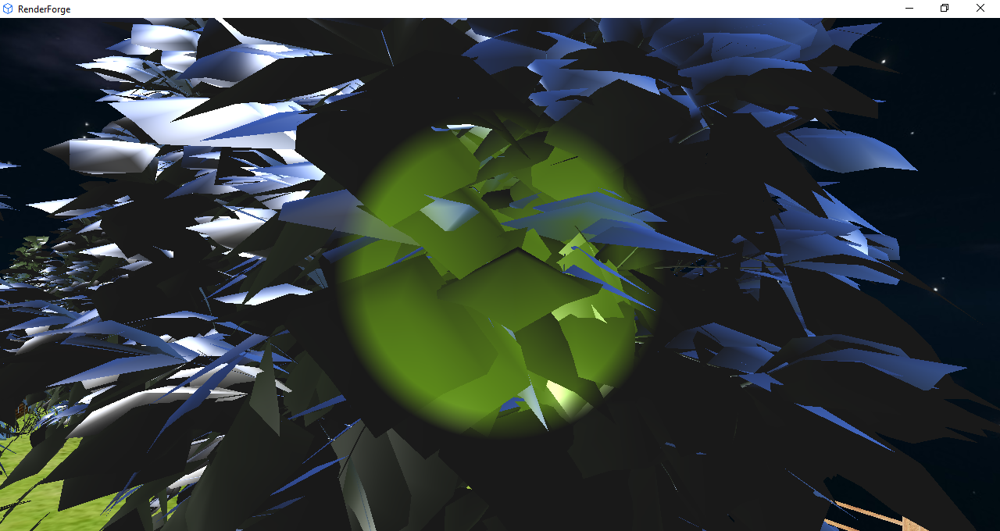
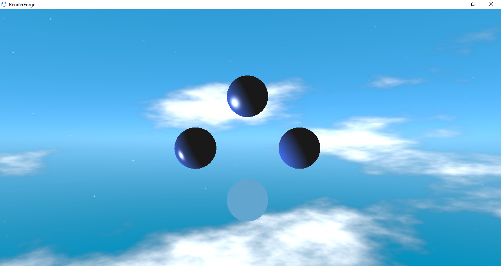
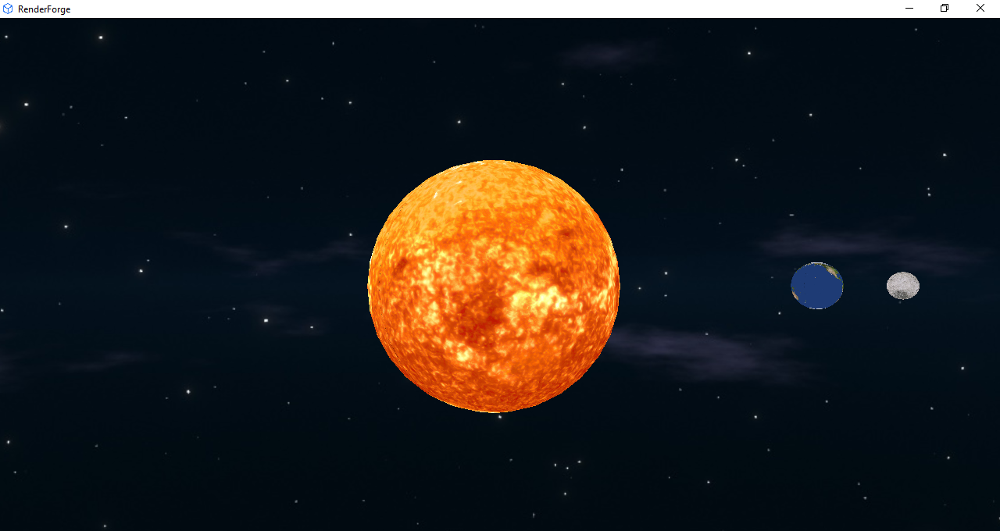

# RenderForge

A C++ OpenGL renderer with three demo scenes, multiple shading models, light types and day/night skyboxes.

## Overview

RenderForge is a custom C++ OpenGL renderer I built as a project for my computer graphics course at university. Models load through Assimp. You can switch between four shading models (constant, Lambert, Phong, Blinn) and three light types (directional, point, spot).

## Tech stack

- **Languages:** C++, GLSL
- **API:** OpenGL
- **Libraries:** GLFW, GLEW, GLM, Assimp, SOIL, stb_image
- **Linter:** SonarQube

## Features

- Four shading models: constant, Lambert, Phong, Blinn
- Three light types: directional, point, spot (spotlight follows the camera)
- Moving fireflies with point lights
- Cubemap skybox with day/night switching per scene
- Model loading via Assimp with vertex position, normal, UV and tangent data
- Texture loading for grass, house, zombie, planets and the skybox
- Transformation system with composable translation, rotation, scale and dynamic rotation
- Observer pattern for camera updates
- Random placement of trees, bushes and zombies

## Scenes

- **Forest** - house, trees, bushes, wooden fence, grass, five zombies, three fireflies
- **Spheres** - four spheres, each rendered with a different shader
- **Planets** - Sun, Earth and Moon orbiting with a space skybox

## Controls

- `W`, `A`, `S`, `D` - move forward, left, back, right
- `F`, `B` - move up and down
- Left mouse button - look around
- `0`, `1`, `2` - switch scenes
- `Esc` - quit

## Screenshots

## Installation

1. Download the latest `RenderForge.zip` from [Releases](https://github.com/mk-forge/render-forge/releases).
2. Extract the ZIP.
3. Run `RenderForge.exe`.

## Building from source

Open `RenderForge.sln` in Visual Studio and build the project. Required libraries are included in the `libs/` folder.

## Credits

- [The Blender Cubemap Skybox Pack](https://drive.google.com/file/d/1V0KlEOLKjjEUAlfCeCxpo-6d4A6tWrdy/view?usp=sharing) by ZGnosis. Free for non-commercial use with attribution.
- [Lowpoly Firefly model](https://skfb.ly/pzZAB) by Caledhril. Licensed under [Creative Commons Attribution](http://creativecommons.org/licenses/by/4.0/).